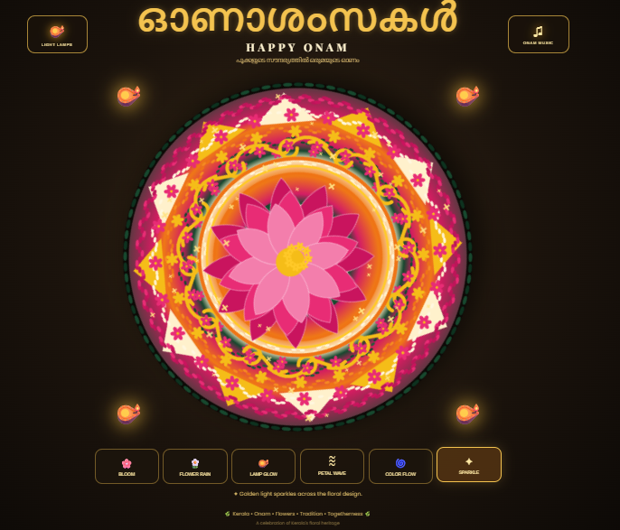

# 🌸𝓒𝓸𝓭𝓮 ~ 𝓐 ~ 𝓟𝓸𝓸𝓴𝓪𝓵𝓪𝓶🌸
### *Welcome to 𝓒𝓸𝓭𝓮 ~ 𝓐 ~ 𝓟𝓸𝓸𝓴𝓪𝓵𝓪𝓶, a creative coding challenge where tradition meets technology! 🌼*

---
# 🌸 Diya Bhatt A's Virtual Athapookalam – Tradition in Motion 2026 🌸

## 👩‍💻 About Me

- **Name:** Diya Bhatt A
- **Branch:** Electronics and Computer Engineering
- **Semester:** S7 ERE
- **Contact Number:** 8100517346
- **Programming Language Used:** Python, HTML, CSS, JavaScript

---

## 🎨 My Pookalam

### Description

My project is an interactive **Virtual Athapookalam** inspired by the traditional floral decorations of Kerala celebrated during Onam.

The design is inspired by the beauty of traditional Kerala Pookalams, particularly the circular floral arrangement and the central lotus motif. Instead of using a static image, the Pookalam is generated programmatically using **HTML Canvas and JavaScript**, allowing individual floral elements and decorative patterns to be animated.

The project combines traditional Kerala culture with modern web technology to create an immersive digital Onam experience.

The Pookalam features a large central lotus surrounded by multiple concentric floral layers, geometric patterns, traditional green leaf borders, decorative flowers, and warm traditional lamp elements.

---

### Preview



*Interactive Virtual Athapookalam created using HTML Canvas, CSS and JavaScript.*

---

## ✨ Features

- 🌸 **Programmatically Generated Pookalam**
  - The floral design is created dynamically using JavaScript Canvas.
  - No external Pookalam image is used.

- 🌺 **Central Lotus Design**
  - A detailed multi-layer lotus is created using individual animated petals.

- 🌼 **Concentric Floral Patterns**
  - Multiple layers of flowers and petals recreate the traditional circular Pookalam structure.

- 🌿 **Kerala-Inspired Green Border**
  - Traditional green leaf patterns surround the floral arrangement.

- 🪔 **Traditional Diya Lamps**
  - Decorative lamps are placed around the Pookalam with animated glowing effects.

- 🔄 **Slow Pookalam Rotation**
  - The entire Pookalam slowly rotates to create a dynamic visual experience.

- 🌸 **Bloom Effect**
  - Flower petals gently pulse and bloom.

- 🌼 **Flower Rain**
  - Animated flowers fall across the screen.

- 🪔 **Lamp Glow**
  - Traditional lamps brighten with a warm glowing effect.

- 〰️ **Petal Wave**
  - Animated wave patterns move through the floral rings.

- ✨ **Sparkle Effect**
  - Golden sparkles appear across the Pookalam.

- 🎵 **Onam Music**
  - Background Onam music can be played through the interactive music button.

- 📱 **Responsive Design**
  - The virtual Pookalam adapts to different screen sizes.

- 🎨 **Traditional + Digital Concept**
  - Kerala's traditional Onam culture is combined with modern interactive web technology.

---

## 🛠️ Technologies Used

| Technology | Purpose |
|---|---|
| 🐍 Python | Backend |
| 🌐 Flask | Web application framework |
| HTML5 | Webpage structure |
| CSS3 | Styling, animations and responsive layout |
| JavaScript | Pookalam generation and interactions |
| HTML Canvas | Dynamic floral artwork |
| CSS Animations | Rotation, glow and visual effects |

---

## 📁 Project Structure

```text
virtual_athapookalam/
│
├── app.py
├── requirements.txt
├── README.md
│
├── templates/
│   └── index.html
│
└── static/
    ├── style.css
    ├── script.js
    └── onam.mp3
------------------
## 🚀 How to Run

Make sure you have the following installed:

- 🐍 **Python 3.x**
- 🌐 **Flask**
- 🖥️ **A modern web browser**

---
### 1️⃣ Clone the Repository

```bash
git clone https://github.com/DIYA-BHATT29/Code-A-Pookalam.git
cd Code-A-Pookalam
```

### 2️⃣ Install Flask

```bash
pip install flask
```

Or:

```bash
pip install -r requirements.txt
```

### 3️⃣ Run the Application

```bash
python app.py
```

The application will run at:

```text
http://127.0.0.1:5000
```

##  Happy Onam!✨
*Submitted for Code-A-Pookalam 2026 by TinkerHub LBSITW*
```
